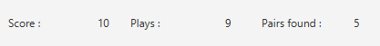

= Memory Game - Aidan Balasch
:toc:
:toc-title: Summary

:imagesdir: assets

== Context
During April 2023, in the process of learning the concepts of JavaFX and interfaces, we were asked to create a memory game starting from a tiny codebase. You can found the report of the project (in French) https://github.com/AidanBalap/memory-game/blob/main/assets/IHM%20Compte%20Rendu%20-%20Aidan%20Balasch.pdf[here].

image::app_main.png[Main menu]

== Installation
To run the project, you need to have JavaFX installed on your computer. You can download it https://gluonhq.com/products/javafx/[here].

Then, you need to add the JavaFX library to your project. To do so, you can follow the steps described https://openjfx.io/openjfx-docs/#install-javafx[here]. 

Finally, you can run the project by executing the `Main.java` file.

== Download
You can download the most up to date app in the https://github.com/AidanBalap/memory-game/releases[release page of this repository]. You can also download the source code of the project and run it yourself :).

== Usage
The game is pretty simple to use. Once tou ran the app, you can create a new game and some cards will appear. You can click on the cards to flip them. If you find two identical cards, they will stay flipped. Otherwise, they will flip back after a short delay.

== Features
=== Number of cards
When starting a new game, you can choose the number of pairs you want to play with. The number of pairs must be even and between 2 and 12.

=== Types of cards
While playing, you can choose between three different types of cards:

* Numbers (or cards)

image::card_number.png[Numbers]

* Colors

image::card_color.png[Colors]

* Emojis

image::card_emoji.png[Emojis]

=== Language selector
You can choose between four languages:

* English

image::app_en.png[English]

* French (Default)

image::app_fr.png[French]

* Spanish

image::app_es.png[Spanish]

* Catalan 

image::app_cat.png[Catalan]

=== Cheat mode
You can activate the cheat mode in the settings of the game. This feature will spawn all pairs of cards next to each other. This way, you can easily find all the pairs (testing purposes).

=== Score
The game keeps track of your score. The score is calculated by the number of clicks you made and the number of pairs found. The less clicks you made, the better your score is.

